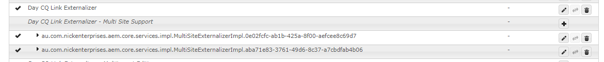
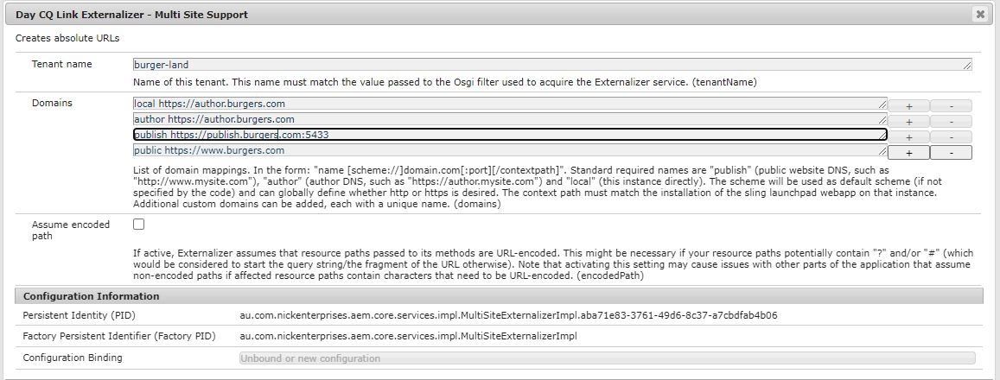

# AEM Multisite Externalizer

The AEM Multisite Externalizer is an enhanced version of the out-of-the-box AEM Link Externalizer component, designed to support multi-site and multi-tenant applications.

:information_source: Note: The AEM Multisite Externalizer is an open-source project and is not an officially supported Adobe product.

One of the main limitations of the OOTB AEM Externalizer is its single configuration. The Multisite Externalizer, on the other hand, offers a factory configuration that allows for the creation of multiple configurations, providing the flexibility to create one configuration per tenant.

By using this approach, you avoid the problems associated with the OOTB solution - fragile hardcoded values in tenant-specific code, and a global configuration containing tenant-specific knowledge. The AEM Multisite Externalizer provides a more elegant and scalable solution, while still maintaining compatibility with the OOTB AEM Externalizer to ensure smooth operation with internal AEM components that depend on it.

## Usage

The AEM Multisite Externalizer is designed to work in conjunction with the out-of-the-box (OOTB) AEM Externalizer. The configuration settings for this extension follow the same format as the default externalizer, but it introduces an additional tenant name field.

Note that fields marked as depricated by Adobe have been removed.

:warning: Important: Many internal AEM components use the default Externalizer. It is crucial to maintain sensible default values in the OOTB Externalizer to ensure stable and predictable outcomes.

The tenant name you provide in the configuration is used to obtain a reference to the externalizer within your tenant's Java bundle. To do so, you'll need to change the way you reference the externalizer.

Instead of using:

    @Reference
    private Externalizer externalizer;

You should use an OSGi filter. This can be done by changing the above code to:

    @Reference(target="(tenantName=<your-site-name>)")
    private Externalizer externalizer;

In this snippet, <your-site-name> should be replaced with your specific tenant's site name.

Please note that there is no default setting available for the tenant name. If the OSGi filter doesn't find any matches for the provided tenant name, the reference will not be satisfied.

## Installation
### Download the Package

Download the zip file for the AEM Multisite Externalizer from << TBA sorry chaps still a work in progress >>.

### Open CRX Package Manager

Navigate to your instance's CRX Package Manager. This can typically be found at http://<your_AEM_instance>:<your_port>/crx/packmgr/index.jsp.

### Upload the Package

Click on the Upload Package button at the top left of the page. Browse for the downloaded zip file and click OK to upload it.

### Install the Package

Once the package is uploaded, you will see it in the list of packages in the CRX Package Manager. Locate the AEM Multisite Externalizer (Open-Source Edition) package and click on the Install button next to it.

### Verify Installation

After the installation is complete, ensure the package is installed correctly. You can do this by checking that the package status is shown as Installed.

## Support
If you encounter any problems or have any questions about the AEM Multisite Externalizer, please open an issue on this GitHub repository. We encourage users to collaborate and help each other in troubleshooting.

When opening an issue, try to be as descriptive as possible. Include any error messages you're seeing, steps to reproduce the issue, and any other information you think might be relevant. The more details you provide, the easier it will be for others to understand your problem and provide help.

Please note that while we strive to review issues as they are submitted, response times may vary. Your patience and understanding are appreciated.

## License

This project is licensed under the Apache License 2.0 - see the LICENSE.md file for details.
